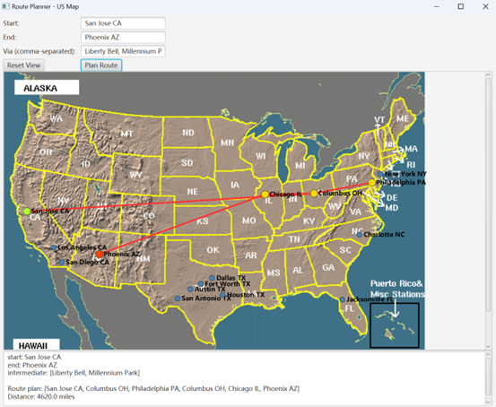

# USA Route Planner


An advanced application for planning optimal road trips across the USA, developed from scratch in Java. This project leverages graph theory and complex algorithms to find the shortest possible travel route between a start and end city, including any number of user-specified attractions along the way.

The application features an interactive map GUI built with JavaFX for intuitive visualization, and also includes a comprehensive performance benchmark of fundamental sorting algorithms as a separate module.

### Demo

Here is a preview of the interactive route planning interface in action:



---

## Core Features

*   **Optimal Route Planning**: Finds the mathematically shortest route that connects a start city, an end city, and a list of intermediate attractions. This is achieved by solving a variation of the Traveling Salesperson Problem (TSP) for the key locations.
*   **Heuristic Route Alternative**: Implements a "Nearest Neighbor" greedy algorithm as a faster, non-optimal alternative for comparison. This is useful for scenarios with a very large number of attractions where computation time is a concern.
*   **Interactive Map Visualization**: A graphical user interface built with JavaFX displays the US map, plots all available cities and roads, and highlights the calculated optimal route.
    *   **Start/End/Intermediate Points**: Start city is marked in green, the destination in red, and intermediate cities in yellow.
    *   **Hover-for-Distance**: Hovering the mouse over a road segment on the map displays a tooltip with the distance in miles.
*   **Data-Driven from CSV**: The entire road network, list of attractions, and city coordinates are loaded from external `.csv` files, making the data easy to manage and extend.
*   **Robust Input Handling**: The application gracefully handles various user input errors, such as non-existent cities, ambiguous state abbreviations (e.g., "CA"), or missing attractions, providing clear feedback to the user.
*   **Sorting Algorithm Benchmarking**: Includes a separate module (`SortingPerformanceTester.java`) to critically evaluate and compare the performance of Insertion Sort, Quick Sort, and Merge Sort on datasets of different sizes and initial orders.

---

## Project Structure

The project is organized with a clear separation between data, resources, and source code.

```
USA-Route-Planner/
│
├── resources/
│   ├── attractions.csv
│   ├── roads.csv
│   ├── city_coordinates.csv
│   ├── map.gif
│   ├── 1000places_sorted.csv
│   └── ... (other data files)
│
├── AttractionMapper.java
├── Graph.java
├── Main.java
├── RoutePlanner.java
├── RoutePlannerApp.java
├── RoutePlannerComparison.java
├── SortingPerformanceTester.java
│
└── README.md
```

---

## How to Run

This project requires the Java Development Kit (JDK) and the JavaFX SDK.

### 1. Running the GUI Application

The main graphical application is `RoutePlannerApp.java`.

**Compile:**
```bash
# Replace with your actual JavaFX SDK path
javac --module-path /path/to/javafx-sdk/lib --add-modules javafx.controls *.java
```

**Run:**
```bash
# Replace with your actual JavaFX SDK path
java --module-path /path/to/javafx-sdk/lib --add-modules javafx.controls RoutePlannerApp
```

### 2. Running the Command-Line Test Cases

The `Main.java` class is configured to run the test cases specified in the coursework, comparing the Optimal and Heuristic algorithms.

**Run:**
```bash
java Main
```

### 3. Running the Sorting Performance Test

The `SortingPerformanceTester.java` module runs the benchmarks for the sorting algorithms.

**Run:**
```bash
java SortingPerformanceTester
```

---

## Algorithms Implemented

### Pathfinding Algorithms

The core of the route planning is handled by two distinct algorithms for comparison.

**1. Optimal Route Algorithm (Dijkstra + Permutations)**

This algorithm guarantees the globally optimal (shortest) route.
*   **Strategy**: It first pre-computes the shortest path between every pair of key points (start, end, and all attraction cities) using Dijkstra's algorithm. These results are stored in a lookup table. Then, it generates all possible permutations of visiting the attractions and calculates the total distance for each permutation using the pre-computed values. Finally, it returns the path corresponding to the permutation with the minimum total distance.
*   **Time Complexity**: `O(n(E + VlogV) + k!)`, where `n` is the number of key points, `k` is the number of attractions, `V` is the number of cities, and `E` is the number of roads. The `k!` term makes it computationally expensive for a large number of attractions.

**2. Heuristic Route Algorithm (Nearest Neighbor)**

This is a greedy algorithm that provides a fast but potentially suboptimal solution.
*   **Strategy**: Starting from the origin, the algorithm repeatedly travels to the nearest unvisited attraction city. After all attractions have been visited, it travels to the final destination.
*   **Advantage**: Much faster than the optimal algorithm, suitable for real-time applications or when the number of attractions is large.

### Sorting Algorithms

The `SortingPerformanceTester` module implements and benchmarks the following algorithms:
*   **Insertion Sort**
*   **Quick Sort** (optimized with a "Median-of-Three" pivot selection strategy to improve performance and avoid worst-case scenarios on sorted data)
*   **Merge Sort**

---

## Code & Architecture Overview

The system is designed with a modular architecture, separating concerns into distinct classes.

*   **`RoutePlannerApp.java` (UI Module)**: The main entry point for the JavaFX application. It handles all user interface elements, input fields, map rendering, and event handling. It coordinates calls to the data loading and route planning modules.

*   **`RoutePlannerComparison.java` & `RoutePlanner.java` (Route Planning Module)**: These classes contain the core logic for pathfinding.
    *   `RoutePlannerComparison` acts as a facade, providing methods to run both the optimal (`route`) and heuristic (`routeHeuristic`) algorithms.
    *   `RoutePlanner` implements the optimal algorithm, including Dijkstra's, permutation generation, and path reconstruction logic.

*   **`Graph.java` & `AttractionMapper.java` (Data Loader Module)**: These classes are responsible for loading and structuring the data from CSV files.
    *   `Graph.java`: Models the US road network using an adjacency list (`Map<String, List<Edge>>`), which is efficient for graph traversal algorithms.
    *   `AttractionMapper.java`: Manages the mapping from attraction names to their corresponding city names using a `HashMap` for constant-time lookups.

*   **`Main.java`**: A command-line interface for running predefined test cases without launching the graphical application.

*   **`SortingPerformanceTester.java`**: A standalone utility for conducting performance analysis of the three sorting algorithms, outputting average execution times in milliseconds.
